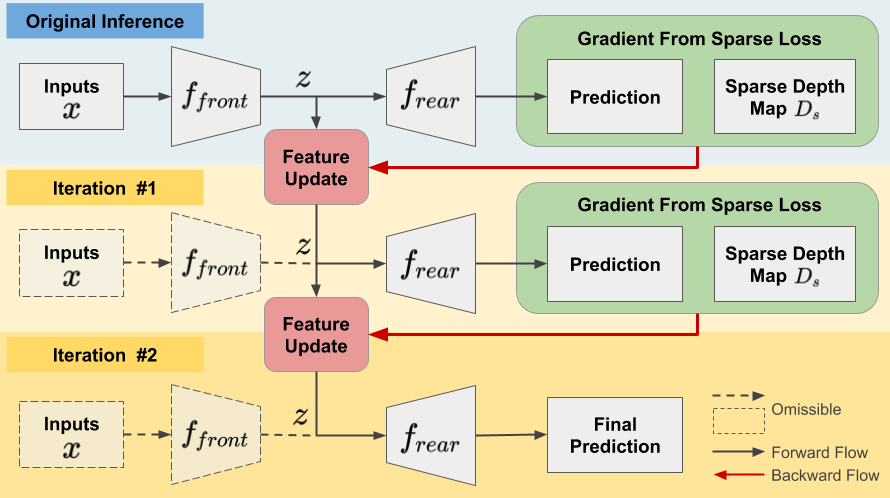

# PnP-Depth
[project page](https://zswang666.github.io/PnP-Depth-Project-Page/) | [paper](https://arxiv.org/abs/1812.08350) | [video](https://drive.google.com/file/d/1XepIu6uSPVI5XidQnabN1_ZLKIfXaQaP/view)

Implementation for "Plug-and-Play: Improve Depth Prediction via Sparse Data Propagation", [ICRA 2019](https://www.icra2019.org/). **PnP-Depth** is used as an add-on module to existing depth completion models. Only with *a few line of modification on the original code*, we can apply **PnP-Depth** to the model and *obatin performance gain*.


The above figure shows the improvement of depth estimation (red regions in the bottom-right figure) by propagating and exploiting information of sparse depth (upper-right) using our **PnP-Depth** module.


## 10-sec to decide whether PnP-Depth is worth a try
You can try **PnP-Depth** out if you are using your whatever estimation/prediction model under the following conditions:
* you are predicting or estimating whatever **given partial or sparse ground truth**.
* your model is **differentiable**, e.g. a deep network.

After applying **PnP-Depth**, you can:
* get **better performance/accuracy** on the prediction,
* but in the sacrifice of inference time.

## Concept and Pseudocode


We first split the original model ```f``` to two parts, ```f_front``` and ```f_rear```, such that ```f(x) = f_rear(f_front(x))```. Given sparse ground truth ```D_s```, our **PnP-Depth** iteratively updates the intermediate representation ```z``` based on the gradient computed from sparse points and re-inference to obtain better depth prediction. Here, we illustrate an example for two iterations.

Here we show the pseudocode of **PnP-Depth**.


## Adding PnP module to your model
Here we show some examples of applying **PnP-Depth** to existing models.
- **PnP-Depth in Pytorch**. There is an example of applying PnP-Depth to a depth completion model originated from [here](https://github.com/fangchangma/sparse-to-dense.pytorch). The modified code is shown in [sparse-to-dense.pytorch](sparse-to-dense.pytorch). We only add a few lines to [model.py](sparse-to-dense.pytorch/model.py) and replace [main.py](sparse-to-dense.pytorch/main.py) with [main_pnp.py](sparse-to-dense.pytorch/main_pnp.py) (new main file is created solely for clarity). *Search for ```PnP-Depth``` in the files to find all modification*. A quick glance at PnP-Depth in Pytorch:
```
import torch
from torch.autograd import Variable
from torch.autograd import grad as Grad

# Original inference
z = model.forward_front(inputs)
ori_pred = model.forward_rear(z)

# Inference with PnP
n_iters = 5 # number of iterations
alpha = 0.01 # update rate
z = model.forward_front(inputs)
for i in range(n_iters):
    if i != 0:
        z = z - alpha * torch.sign(z_grad) # iterative Fast Gradient Sign Method
    z = Variable(z, requires_grad=True)
    pred = model.forward_rear(z)
    if i < n_iters - 1:
        loss = criterion(pred, sparse_depth) # "sparse_depth" can be replaced with any partial ground truth
        z_grad = Grad([loss], [z], create_graph=True)[0]
# "pred" is the prediction after PnP module
```
- **PnP-Depth in Pytorch**. A quick glance at PnP-Depth in Tensorflow:
```
import tensorflow as tf

def model_front(x):
    ... # whatever definition for your model here

def model_rear(z, reuse=False):
    with tf.variable_scope('', reuse=reuse):
        ... # whatever definition for your model here
        
# Original inference
z = model_front(inputs)
ori_pred = model_rear(z)

# Inference with PnP
n_iters = 5 # number of iterations
alpha = 0.01 # update rate

def _cond(z_loop, i_loop):
    return tf.less(i_loop, n_iters)

def _body(z_loop, i_loop):
    pred_loop = model_rear(z)
    loss_loop = criterion(pred_loop, sparse_depth) # "sparse_depth" can be replaced with any partial ground truth
    z_grad_loop = tf.gradients(loss_loop, z_loop)
    z_loop = tf.stop_gradients(z_loop - alpha * tf.sign(z_grad_loop))
    return z_loop, i_loop + 1
    
z = model_front(inputs)
z, _ = tf.while_loop(_cond, _body, (z, 0), back_prop=False, name='pnp')
pred = model_rear(z, True)
# "pred" is the prediction after PnP module
```
